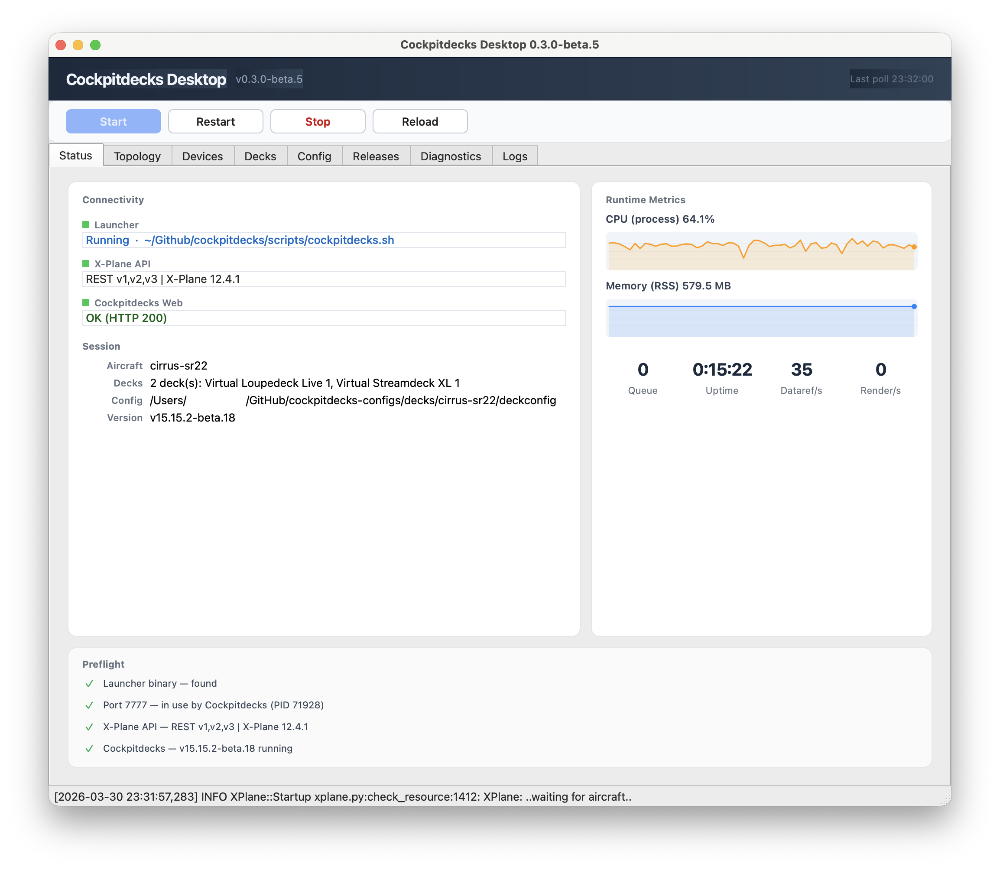
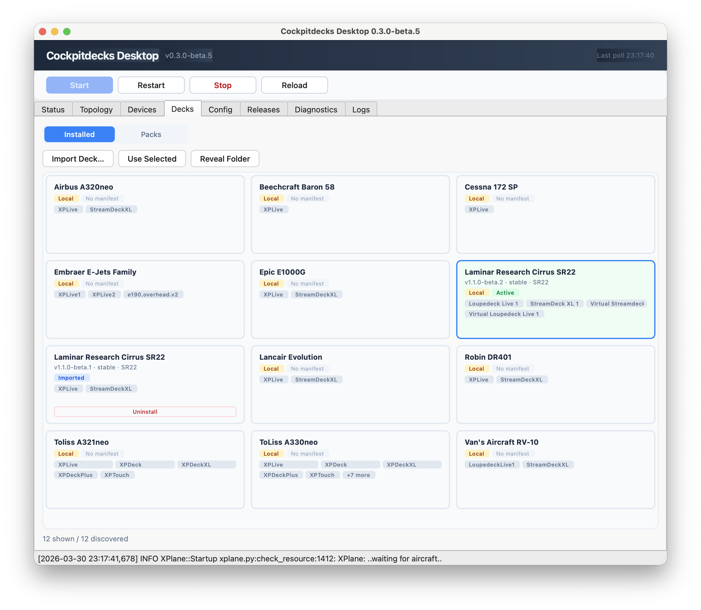
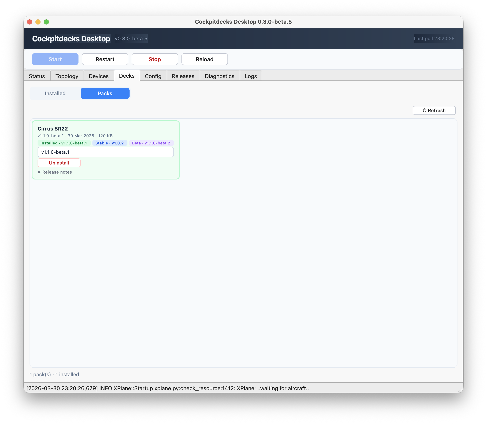
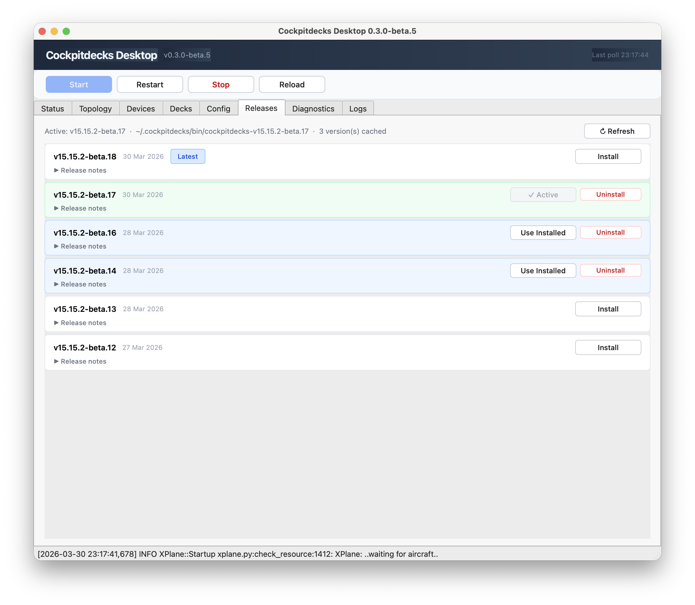
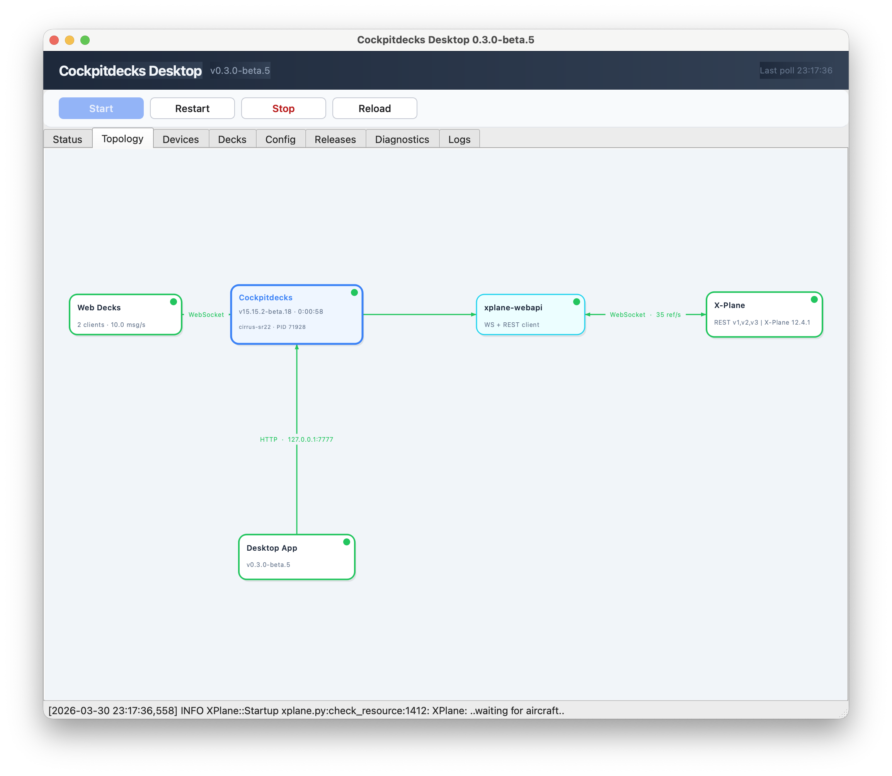

# cockpitdecks-desktop

`cockpitdecks-desktop` is the Qt desktop companion for [`cockpitdecks`](https://github.com/dlicudi/cockpitdecks). It is meant to make day-to-day setup and operations easier: start and stop the launcher, inspect topology and health, manage aircraft deck packs, and install or switch managed `cockpitdecks` releases.

The app orchestrates existing Cockpitdecks pieces. It does not replace the main launcher or duplicate deck runtime logic.

## Screenshots

### Status



### Decks: Installed



### Decks: Packs



### Releases



### Topology



## What The App Does

- Shows live status for `cockpitdecks`, `xplane-webapi`, and X-Plane connectivity
- Lists detected physical and virtual decks
- Visualizes topology, including active web decks
- Browses installed aircraft deck packs from disk
- Browses available deck packs from `cockpitdecks-configs` GitHub releases
- Installs pack versions into the local configs area
- Browses `cockpitdecks` GitHub releases
- Downloads and caches multiple launcher versions locally
- Lets you switch between cached launcher versions without re-downloading

## Main Tabs

### Status

Operational summary for the local environment: launcher status, current aircraft, connectivity, and recent polling state.

### Topology

Relationship view of X-Plane, `xplane-webapi`, `cockpitdecks`, physical decks, and active web decks.

### Devices

Deck and device-oriented runtime view, including reload actions against the running Cockpitdecks instance.

### Decks

Two subviews:

- `Installed`: aircraft/deck packs already present on disk
- `Packs`: aircraft packs available from GitHub releases, grouped one card per aircraft pack

The `Installed` view shows local metadata plus layout/deck labels.

The `Packs` view is version-aware:

- one card per aircraft pack
- latest stable and latest prerelease are surfaced on the card
- install happens for the selected version
- already installed versions can be reused without downloading again

### Releases

Launcher release management for `cockpitdecks` itself.

Current behavior:

- `Install` downloads and installs the selected release
- while installing, the button becomes `Cancel`
- installed releases are cached by version
- cached but inactive releases show `Use Installed`
- the active managed version shows `✓ Active`
- cached versions can be removed with `Uninstall`

This makes it possible to keep several launcher versions locally and switch between them quickly.

### Diagnostics / Logs

Runtime inspection and troubleshooting views for local use when validating startup, connectivity, and runtime behavior.

## Development

### Requirements

- Python 3.12+
- macOS is the main target today

### Editable install

```bash
python3 -m venv .venv
source .venv/bin/activate
pip install -e .
cockpitdecks-desktop
```

## Build

### PyInstaller app bundle

```bash
scripts/build_desktop.sh
```

`scripts/build_desktop.sh` bundles a `cockpitdecks` sidecar into the desktop app before running PyInstaller. By default it uses `../cockpitdecks/dist/cockpitdecks`, but you can override that with:

```bash
LAUNCHER_SRC=/path/to/cockpitdecks scripts/build_desktop.sh
```

## Managed Launcher Releases

The Releases tab installs managed launcher binaries under the desktop app's install area instead of overwriting one shared binary each time.

That means:

- multiple versions can coexist locally
- one version is marked active
- switching to another cached version does not require a download
- uninstall removes only the selected cached version

## Automated macOS Apple Silicon Release

GitHub Actions can build and publish a macOS arm64 desktop app from this repo, bundling a published launcher binary from the `cockpitdecks` GitHub releases.

- Workflow: `.github/workflows/release-desktop-macos-arm64.yml`
- Launcher manifest: `.github/desktop-macos-arm64.env`
- Trigger: push a tag matching `desktop-v*`
- Manual trigger: `workflow_dispatch` with required `release_tag` and optional `launcher_tag`
- Output artifact: `cockpitdecks-desktop-macos-arm64-<tag>.tar.gz`

The workflow downloads `cockpitdecks-macos-arm64-<launcher_tag>.tar.gz` from the configured launcher repository, verifies its SHA-256 checksum, unpacks `cockpitdecks`, bundles it into `Cockpitdecks Desktop.app`, and publishes the desktop artifact plus `build-metadata.json`.

## App Icon

Bundled at `src/cockpitdecks_desktop/resources/app_icon.png`.

- use a square source image, ideally 1024x1024
- the same asset is used for the window and dock icon in dev and packaging flows

If you replace the PNG, regenerate the padded square source with:

```bash
python3 scripts/square_app_icon.py
```

### Still seeing the old icon?

- PyInstaller build: rebuild with `pyinstaller --clean packaging/pyinstaller/desktop.spec` or `scripts/build_desktop.sh`
- Editable install: rerun `pip install -e .`, fully quit the app, then relaunch
- macOS cache: run `bash scripts/refresh_macos_icon_cache.sh`
